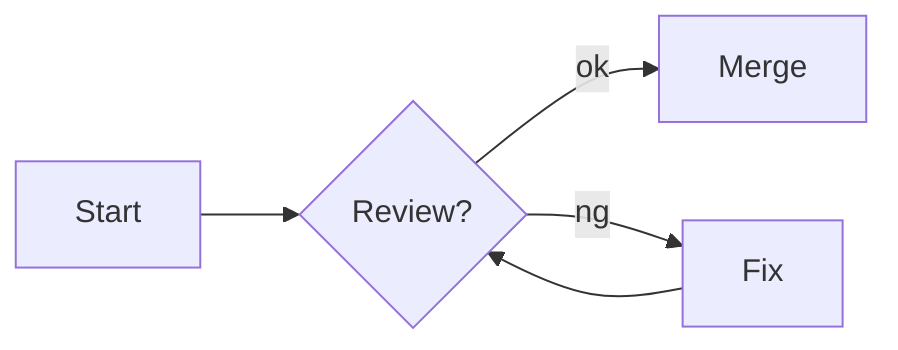

# No text layout

A flowchart that draws as a picture but has no text layout keeps its source.

```mermaid
flowchart LR
  A[Start] --> B{Review?}
  B -->|ok| C[Merge]
  B -->|ng| D[Fix]
  D --> B
```

The paragraph after the diagram still renders.
