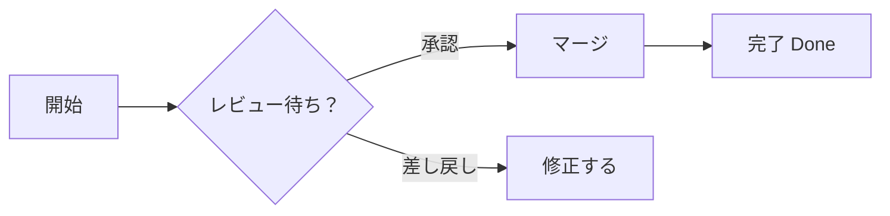
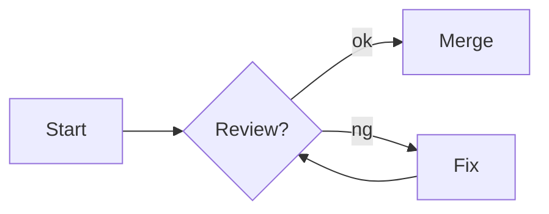
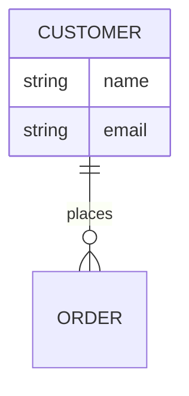
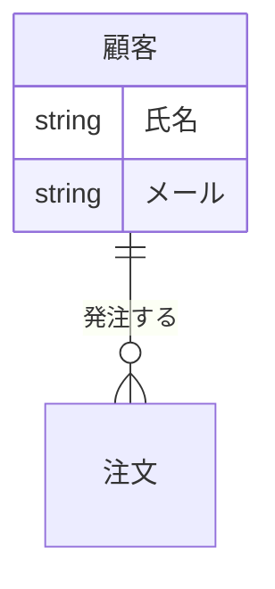

# S2 の対照用 Mermaid（日本語・英語・ループの有無）

## flowchart（ループなし）

```mermaid
flowchart LR
  A[開始] --> B{レビュー待ち？}
  B -->|承認| C[マージ]
  B -->|差し戻し| D[修正する]
  C --> E[完了 Done]
```

## flowchart（英語・ループあり、対照）

```mermaid
flowchart LR
  A[Start] --> B{Review?}
  B -->|ok| C[Merge]
  B -->|ng| D[Fix]
  D --> B
```

## erDiagram（英語の属性、対照）

```mermaid
erDiagram
  CUSTOMER ||--o{ ORDER : places
  CUSTOMER {
    string name
    string email
  }
```

## erDiagram（日本語の属性名。merman 0.7.0 は panic する）

```mermaid
erDiagram
  顧客 ||--o{ 注文 : 発注する
  顧客 {
    string 氏名
    string メール
  }
```
