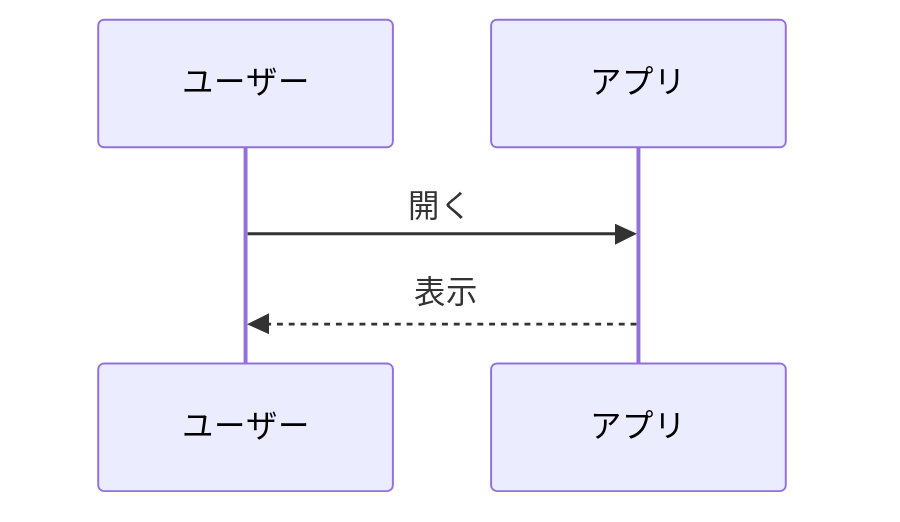

# 図と画像

前置きの段落。

```mermaid
sequenceDiagram
    participant U as ユーザー
    participant A as アプリ
    U->>A: 開く
    A-->>U: 表示
```

```mermaid
flowchart LR
    A --> 
```

後続の段落。スクロールしても図が崩れないことを確認する。
